# skin.xml Reference

This is the current reference for Studio Pro `skin.xml` UI definitions,
organized by functional category.

Custom dialogs require `Package:SkinFile` in `metainfo.xml`:

```xml
<Attribute id="Package:SkinFile" value="skin/"/>
```

## Table of Contents

1. [1. Document Structure](#1-document-structure)
2. [2. Layout Containers](#2-layout-containers)
3. [3. Template & Control Flow](#3-template--control-flow)
4. [4. Text & Display](#4-text--display)
5. [5. Input Controls](#5-input-controls)
6. [6. Collection & Navigation Controls](#6-collection--navigation-controls)
7. [7. Style Helpers & Host Styles](#7-style-helpers--host-styles)
8. [8. Image & Shape Resources](#8-image--shape-resources)
9. [9. Skin.xml Index](#9-skinxml-index)

## 1. Document Structure

### Skin

`Skin` is the top-level root element for the file. Top-level elements appear directly under `<Skin>`.

**skin.xml Snippet:**

```xml
<?xml version="1.0" encoding="UTF-8"?>
<Skin>
  <Styles/>
  <Forms>
    <Form name="MyDialog" title="My Dialog"/>
  </Forms>
</Skin>
```

### Externals / External

`Externals` is a top-level namespace import block. `External` declares one
imported namespace pattern that can be referenced elsewhere in the skin.

**skin.xml Snippet:**

```xml
<Externals>
  <External name="@Main.*"/>
  <External name="Standard.*"/>
</Externals>

<Styles>
  <Style name="MyLabel" inherit="Standard.AddIn.Label"/>
</Styles>

```

| Attribute Name | Description | Type |
|---|---|---|
| `name` | Namespace pattern imported by `External`. | identifier |

| **name** | Description |
|---|---|
| `@Main.*` | - |
| `PresonusUI` | - |
| `PresonusUI*` | - |
| `Standard.*` | - |

**Notes**

- Imported names do not render on their own; they make host-provided resources available for later references.

### Resources

`Resources` is a top-level skin block used to define reusable named assets for
the form.

**skin.xml Snippet:**

```xml
<Resources>
  <Image name="ImagePreview" url="images/image.png"/>
</Resources>
```

**Notes**

- Declare named assets here and reference them from other elements/controls.

### Shapes

`Shapes` is a top-level container for named vector shape resources. Child element details for `Shape`, `ShapeImage`, `Rectangle`, `Triangle`, `Ellipse`, and `Line` are grouped under [Shape](#shape).

**skin.xml Snippet:**

```xml
<Shapes>
  <Shape name="DividerShape" size="0,0,120,12" style="scale">
    <Rectangle size="0,4,120,4"
               style="fill stroke"
               Brush.color="hsl(204,11,64)"
               Pen.color="hsl(0,0,12)"/>
  </Shape>
</Shapes>
```

### Styles

`Styles` is a top-level container for defining reusable skin styling rules for controls, including
colors, fonts, and alignment helpers. Style-level details for `Style`,
`Color`, `Font`, and `Align` are grouped in [Style Helpers & Host
Styles](#7-style-helpers--host-styles).

**skin.xml Snippet:**

```xml
<Styles>
  <Style name="MyEditBox" inherit="Standard.AddIn.EditBox">
    <Color name="backcolor" color="#1A1A2E"/>
    <Color name="textcolor" color="#FFFFFF"/>
    <Font name="textfont" themeid="PresonusUI" size="13" bold="true"/>
  </Style>
</Styles>
```

### Forms

`Forms` is the required container for dialog definitions.

**skin.xml Snippet:**

```xml
<Forms>
  <Form name="MyDialog" title="My Dialog"/>
</Forms>
```

### Form

`Form` defines one dialog surface.

**skin.xml Snippet:**

```xml
<Form name="MyDialog" title="My Dialog" firstfocus="NameHere">
  <Horizontal margin="0">
    <DialogGroup>
      <Vertical margin="10" spacing="5">
        <!-- Form content here -->
        <EditBox name="NameHere" attach="left right"/>
      </Vertical>
    </DialogGroup>
  </Horizontal>
</Form>
```

| Attribute Name | Description | Type |
|---|---|---|
| `attach` | Content attachment/alignment. | token |
| `buttons` | Dialog button set. | token |
| `firstfocus` | Initial focus target. | identifier |
| `height` | Explicit height. | number |
| `datatarget` | Data target binding. | identifier |
| `helpid` | Help identifier. | identifier |
| `image` | Background image resource reference. | identifier |
| `layerbacking` | - | token |
| `name` | Dialog identifier used by `runDialog(...)`. | identifier |
| `options` | Visual or behavioral options.| token |
| `selectname` | - | identifier |
| `sizelimits` | Defines size limits. | tuple |
| `size` | Explicit size geometry. | tuple |
| `style` | Style reference. | identifier |
| `title` | Visible title text. | text |
| `tooltip` | Tooltip text. | text |
| `width` | Explicit width. | number |
| `windowstyle` | Host window chrome and behavior. | token |

| **buttons** | Description |
|---|---|
| `apply` | Apply changes without closing. |
| `cancel` | Cancel and close without applying. |
| `close` | Close the dialog. |
| `okay` | Confirm and close the dialog. |

| **layerbacking** | Description |
|---|---|
| `optional` | - |
| `true` | - |


| **options** | Description |
|---|---|
| `colorize` | Colors the form area. |
| `windowmovable` | Allow drag from form area. |


| **windowstyle** | Description |
|---|---|
| `above` | - |
| `center` | - |
| `customframe` | - |
| `dialogstyle` | - |
| `floating` | - |
| `fullscreen` | Uses fullscreen window behavior. |
| `inflate` | Expands the dialog content area. |
| `maximize` | Enables a maximize-capable window. |
| `intermediate` | - |
| `panelstyle` | - |
| `pluginhost` | - |
| `roundedcorners` | - |
| `restorepos` | Restores the previous window position. |
| `restoresize` | Restores the previous window size. |
| `sheetstyle` | - |
| `sizable` | Makes the window resizable. |
| `titlebar` | - |
| `translucent` | Uses translucent window chrome. |

- `Form image="..."` sets a background image for the whole dialog.

## 2. Layout Containers

### Vertical

`Vertical` is a layout container that stacks child elements vertically.

**skin.xml Snippet:**

```xml
<Vertical spacing="8" margin="10" attach="left right">
  <!-- children stacked vertically -->
</Vertical>
```

| Attribute Name | Description | Type |
|---|---|---|
| `attach` | Layout attachment/alignment. | token |
| `height` | Explicit height. | number |
| `margin` | Inner padding around the container contents. | number |
| `options` | Visual or layout options. | token |
| `persistence.id` | Persistent layout state key. | identifier |
| `size` | Position and size geometry. | tuple |
| `sizelimits` | Defines size limits. | tuple |
| `spacing` | Space between children. | number |
| `width` | Explicit width. | number |
| `name` | Container binding name. | identifier |
| `title` | Display title. | text |

| **options** | Description |
|---|---|
| `adaptive` | - |
| `hidepriority` | - |
| `nohelp` | - |
| `secondary` | - |
| `unifysizes` | - |


### Horizontal

`Horizontal` is a layout container that arranges child elements horizontally.

**skin.xml Snippet:**

```xml
<Horizontal spacing="4" margin="5" attach="left right">
  <!-- children arranged horizontally -->
</Horizontal>
```

| Attribute Name | Description | Type |
|---|---|---|
| `attach` | Layout attachment/alignment. | token |
| `height` | Explicit height. | number |
| `margin` | Inner padding around the container contents. | number |
| `options` | Visual or layout options. | token |
| `persistence.id` | Persistent layout state key. | identifier |
| `size` | Position and size geometry. | tuple |
| `sizelimits` | Defines size limits. | tuple |
| `spacing` | Space between children. | number |
| `width` | Explicit width. | number |
| `columns` | Columns in the layout. | number |
| `name` | Container binding name. | identifier |
| `style` | Style reference. | identifier |
| `title` | Display title. | text |
| `tooltip` | Tooltip text. | text |

| **options** | Description |
|---|---|
| `hidepriority` | - |
| `unifysizes` | - |
| `wrap` | - |


### View

`View` is a layout wrapper and positioned container.

**skin.xml Snippet:**

```xml
<View size="40,10,150,220">
  <Vertical spacing="2">
    ...
  </Vertical>
</View>
```

| Attribute Name | Description | Type |
|---|---|---|
| `attach` | Layout attachment/alignment. | token |
| `height` | Explicit height. | number |
| `margin` | Inner padding around container contents. | number |
| `name` | Wrapper name. | identifier |
| `options` | Visual or layout options. | token |
| `size` | Position and size geometry. | tuple |
| `sizelimits` | Defines size limits. | tuple |
| `style` | Style reference. | identifier |
| `title` | Display title. | text |
| `tooltip` | Tooltip text. | text |
| `type` | View subtype. | identifier |
| `width` | Explicit width. | number |

| **options** | Description |
|---|---|
| `directupdate` | - |
| `horizontal` | Horizontal orientation. |
| `transparent` | Transparent rendering. |
| `vertical` | Vertical orientation. |


**Notes**

- `View` is used to position blocks of controls while inner `Vertical` and `Horizontal` containers handle local flow.

### DialogGroup

<p align="center">
  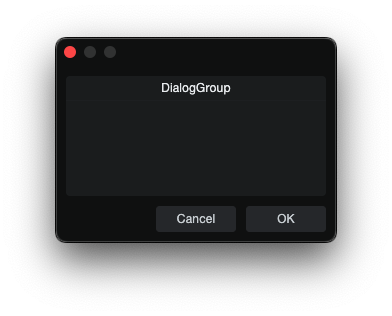
</p>

`DialogGroup` is a visible container for housing other elements.

**skin.xml Snippet:**

```xml
<Form name="DialogGroupExample" title="DialogGroup Example">
  <DialogGroup title="Value Fields" width="220" height="100">
    <Vertical margin="8" spacing="4">
      <Label title="ValueBox and TextBox"/>
      <ValueBox name="ValueText" width="140" height="22"/>
      <TextBox name="DisplayText" width="180" height="22"/>
    </Vertical>
  </DialogGroup>
</Form>
```

| Attribute Name | Description | Type |
|---|---|---|
| `attach` | Layout attachment/alignment. | token |
| `height` | Explicit height. | number |
| `options` | Visual and behavioral settings. | token |
| `size` | Position and size geometry. | tuple |
| `sizelimits` | Defines size limits. | tuple |
| `style` | Style reference. | identifier |
| `title` | Display title. | text |
| `width` | Explicit width. | number |

| **options** | Description |
|---|---|
| `secondary` | - |
| `transparent` | Transparent rendering. |


### Table

<p align="center">
  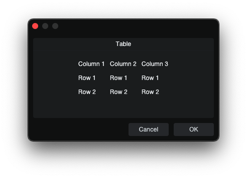
</p>

`Table` is a grid layout container. Child elements are assigned to cells in
source order, moving left to right across each row and then continuing on the
next row.

**skin.xml Snippet:**

```xml
<Table columns="2" margin="0" spacing="6">
  <Label title="Name"/>
  <EditBox name="Name"/>

  <Label title="Count"/>
  <ValueBox name="Count"/>
</Table>
```

| Attribute Name | Description | Type |
|---|---|---|
| `attach` | Layout attachment/alignment. | token |
| `cellratio` | Cell sizing ratio. | number |
| `columns` | Number of columns in the grid. | number |
| `height` | Explicit height. | number |
| `margin` | Inner padding around the table contents. | number |
| `name` | Table binding name. | identifier |
| `size` | Table geometry. | tuple |
| `spacing` | Space between cells. | number |
| `sizelimits` | Defines size limits. | tuple |
| `width` | Explicit width. | number |

**Notes**

- Ex. With `columns="2"`, children fill table in order of placement, top to bottom: row 1 col 1, row 1 col 2, row 2 col 1, row 2 col 2.
- `<Null/>` can be used as an empty placeholder cell.

### Space

`Space` is a lightweight layout spacer used to add fixed blank area between
controls.

**skin.xml Snippet:**

```xml
<Vertical margin="0" spacing="8">
  <Label title="Top Control"/>
  <Space height="4"/>
  <Label title="Bottom Control"/>
</Vertical>
```

| Attribute Name | Description | Type |
|---|---|---|
| `attach` | Layout attachment/alignment. | token |
| `name` | Space name. | identifier |
| `height` | Fixed spacer height. | number |
| `size` | Position and size geometry. | tuple |
| `sizelimits` | Defines size limits. | tuple |
| `width` | Fixed spacer width. | number |

### TabView

<p align="center">
  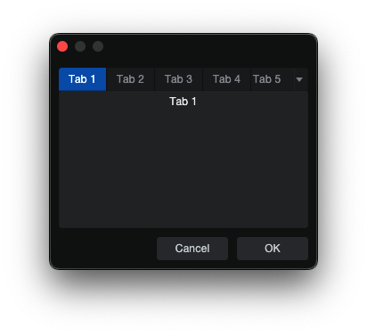
</p>

`TabView` is a multi-page container.

**skin.xml Snippet:**

```xml
<TabView name="OptionTabs" width="300" height="180">
  <DialogGroup title="Tab 1">
  <!-- tab content -->
  </DialogGroup>
  <Control title="Tab 2">
  <!-- tab content -->
  </Control>
  <View title="Tab 3">
  <!-- tab content -->
  </View>
</TabView>
```

| Attribute Name | Description | Type |
|---|---|---|
| `attach` | Layout attachment/alignment. | token |
| `height` | Explicit height. | number |
| `name` | Tabview binding name. | identifier |
| `options` | Visual or behavioral options.| token |
| `persistence.id` | Persistent layout state key. | identifier |
| `size` | Explicit size geometry. | tuple |
| `sizelimits` | Defines size limits. | tuple |
| `style` | Style reference. | identifier |
| `width` | Explicit width. | number |

| **options** | Description |
|---|---|
| `extendtabs` | - |
| `fitallviews` | - |
| `fontbold` | - |
| `nohoveractivate` | - |
| `reorder` | - |

**Notes**

- Confirmed page container types: `DialogGroup`, `Control`, `View`, `Table`.
- Use each child page container `title` for the tab label.
- A dropdown is added automatically when the tab strip exceeds available width.

## 3. Template & Control Flow

### Variant

`Variant` is a dynamic XML switch that swaps child branches based on a bound
parameter or host/controller property.

**skin.xml Snippet:**

```xml
<RadioButton name="FlowMode" value="0" title="Branch 0"/>
<RadioButton name="FlowMode" value="1" title="Branch 1"/>
<RadioButton name="FlowMode" value="2" title="Branch 2"/>

<Variant name="FlowMode" options="boundvalue" width="300" height="40">
  <View width="300" height="40">
    <Label title="Variant branch 0 is active."/>
  </View>
  <View width="300" height="40">
    <Label title="Variant branch 1 is active."/>
  </View>
  <View width="300" height="40">
    <Label title="Variant branch 2 is active."/>
  </View>
</Variant>
```

**scriptname.js Snippet:**

```javascript
this.FlowMode = context.parameters.addInteger(0, 2, "FlowMode");
this.FlowMode.value = 0;
```

| Attribute Name | Description | Type |
|---|---|---|
| `attach` | Layout attachment/alignment. | token |
| `controller` | Controller path or binding. | identifier |
| `height` | Explicit height. | number |
| `name` | Branch selector binding. | identifier |
| `options` | Variant switching behavior options. | token |
| `property` | Controller property name. | identifier |
| `size` | Position and size geometry. | tuple |
| `sizelimits` | Defines size limits. | tuple |
| `width` | Explicit width. | number |

| **options** | Description |
|---|---|
| `boundvalue` | Switches children based on the current bound value. |
| `fill` | - |
| `invert` | - |
| `selectalways` | - |
| `vertical` | Vertical orientation. |

### using

`using` sets the active controller context for nested content.

**skin.xml Snippet:**

```xml
<using controller="object://studioapp/Application">
  <if property="isVideoEnabled" value="1">
    <Label title="Application controller resolved: video enabled."/>
  </if>
</using>
```

| Attribute Name | Description | Type |
|---|---|---|
| `controller` | Controller path or binding. | identifier |
| `optional` | Allows missing controllers. | flag |

| **optional** | Description |
|---|---|
| `true` | - |

### define

`define` creates local substitution values for nested XML content.

**skin.xml Snippet:**

```xml
<define statusText="Defined branch rendered." showDetails="1">
  <if defined="$showDetails">
    <Label title="$statusText"/>
  </if>
</define>
```

**Notes**

- `define` accepts user-defined substitution attributes.
- Nested XML can reference those values with `$attributeName`, such as `$statusText` or `$showDetails`.
- Substitution values can be text, numbers, identifiers, tuples, or other XML attribute values.

### if

`if` conditionally renders nested content based on a property or substitution variable.

**skin.xml Snippet:**

```xml
<if not.defined="$missingFlag">
  <Label title="missingFlag is not defined."/>
</if>
```

| Attribute Name | Description | Type |
|---|---|---|
| `controller` | Controller path or binding. | identifier |
| `defined` | Requires an existing substitution. | identifier |
| `not.defined` | Requires a missing substitution. | identifier |
| `property` | Controller property name. | identifier |
| `value` | Value to compare against. | text |

## 4. Text & Display

### Label

| Plain | Local Styled |
|---|---|
| <p align="center">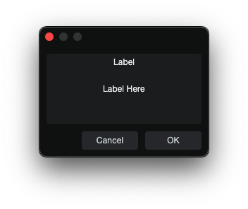</p> | <p align="center">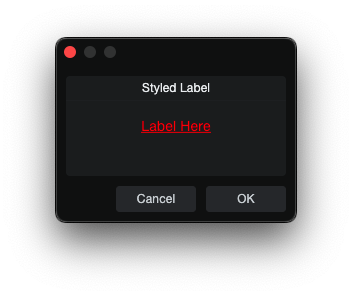</p> |

`Label` is a static text element.

**skin.xml Snippet:**

```xml
<Label title="Static Label"/>
```

| Attribute Name | Description | Type |
|---|---|---|
| `attach` | Layout attachment/alignment. | token |
| `height` | Explicit height. | number |
| `localize` | Localization toggle. | flag |
| `options` | Visual or behavioral options. | token |
| `size` | Position and size geometry. | tuple |
| `sizelimits` | Defines size limits. | tuple |
| `style` | Style reference. | identifier |
| `title` | Visible title text. | text |
| `tooltip` | Hover help text. | text |
| `value` | - | text |
| `width` | Explicit width. | number |

| **options** | Description |
|---|---|
| `colorize` | - |
| `fittext` | - |
| `multiline` | Multi-line editing mode. |
| `nohelp` | - |
| `transparent` | Transparent rendering. |


### Link

<p align="center">
  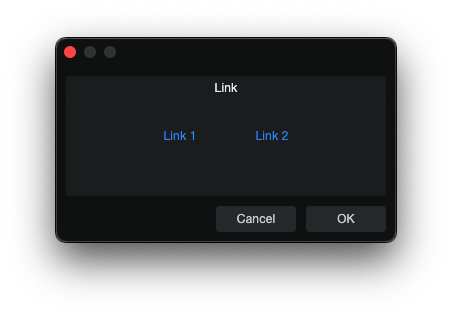
</p>

`Link` is a clickable text-style control.

**skin.xml Snippet:**

```xml
<Horizontal spacing="8">
  <Link name="Link 1" title="Link 1" attach="vcenter" style="MyLinkStyle"/>
  <Link name="Link 2" title="Link 2" attach="vcenter" style="MyLinkStyle"/>
</Horizontal>
```

**scriptname.js Snippet:**

```javascript
this.paramList = Host.Classes.createInstance("CCL:ParamList");
this.paramList.controller = this;

this.Link1 = this.paramList.addParam("Link 1");
this.Link2 = this.paramList.addParam("Link 2");

this.paramChanged = function(param)
{
    if(param == this.Link1)
        Host.GUI.openUrl(Host.Url("https://example.com/", true));
    else if(param == this.Link2)
        Host.GUI.openUrl(Host.Url("local://$USERCONTENT", true));
}
```

| Attribute Name | Description | Type |
|---|---|---|
| `attach` | Layout attachment/alignment. | token |
| `height` | Explicit height. | number |
| `name` | Link binding name. | identifier |
| `options` | Visual or behavioral options.| token |
| `size` | Position and size geometry. | tuple |
| `style` | Style reference. | identifier |
| `title` | Display title. | text |
| `tooltip` | Tooltip text. | text |
| `width` | Explicit width. | number |

| **options** | Description |
|---|---|
| `button` | - |
| `fittext` | - |
| `fittitle` | - |
| `transparent` | - |
| `urltitle` | - |

**Notes**

- JS surface binds `Link` through `addParam(...)` and handles clicks in `paramChanged(...)`.

### TextBox

<p align="center">
  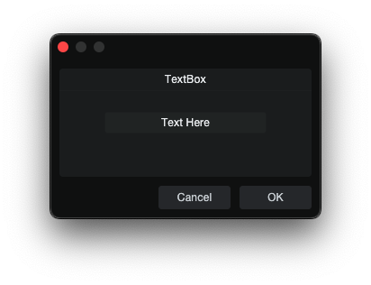
</p>

`TextBox` is an uneditable display field.

**skin.xml Snippet:**

```xml
<TextBox name="DisplayText" width="360" height="48"/>
```

**scriptname.js Snippet:**

```javascript
this.DisplayText = context.parameters.addString("DisplayText");
this.DisplayText.value = "";
```

| Attribute Name | Description | Type |
|---|---|---|
| `attach` | Layout attachment/alignment. | token |
| `colorname` | - | identifier |
| `height` | Explicit height. | number |
| `name` | TextBox binding name. | identifier |
| `options` | Visual or behavioral options.| token |
| `size` | Position and size geometry. | tuple |
| `sizelimits` | Defines size limits. | tuple |
| `style` | Style reference. | identifier |
| `texttrimmode` | Text trimming mode. | token |
| `tooltip` | Tooltip text. | text |
| `width` | Explicit width. | number |

| **options** | Description |
|---|---|
| `border` | Visible field border. |
| `composited` | - |
| `directupdate` | - |
| `fittext` | - |
| `hfit` | - |
| `hidefocus` | - |
| `markup` | - |
| `multiline` | Multi-line display mode. |
| `nocontextmenu` | Disable the context menu. |
| `nohelp` | - |
| `scaletext` | - |
| `transparent` | Transparent display. |


**Notes**

- TextBox can be prefilled by setting the parameter `.value` before the dialog opens.
- For multiline `TextBox` controls, apply a style alignment such as `<Align name="textalign" align="left top"/>`.

### ImageView

`ImageView` displays a named image resource, `ImagePart`, or `ShapeImage`.

**skin.xml Snippet:**

```xml
<Vertical spacing="4">
  <ImageView image="LeftSegment" width="24" height="48" tooltip="Left segment"/>
  <ImageView image="RightSegmentTinted" width="24" height="48" tooltip="Tinted right segment"/>
</Vertical>
```

| Attribute Name | Description | Type |
|---|---|---|
| `attach` | Layout attachment/alignment. | token |
| `height` | Explicit height. | number |
| `image` | Named image resource. | identifier |
| `options` | Visual or behavioral options.| token |
| `provider` | Host-provided image source. | identifier |
| `selectname` | Selection-binding name. | identifier |
| `size` | Rectangle geometry. | tuple |
| `sizelimits` | Defines size limits. | tuple |
| `style` | Style reference. | identifier |
| `tooltip` | Tooltip text. | text |
| `width` | Explicit width. | number |

| **options** | Description |
|---|---|
| `allowstretch` | - |
| `allowzoom` | Zoom behavior. |
| `centerimage` | Center image. |
| `colorize` | Colorize the form area. |
| `fitimage` | Fit image to area. |
| `highquality` | High-quality rendering. |
| `ignoreimagesize` | Ignore image size. |
| `insertdata` | - |
| `nohelp` | - |
| `swallowmouse` | - |
| `translucent` | - |
| `transparent` | - |
| `windowmovable` | Allow drag from form area. |

**Notes**

- `ImageView` can sit inside a container like a normal visual control.

### Divider

| Plain | Local Styled |
|---|---|
| <p align="center">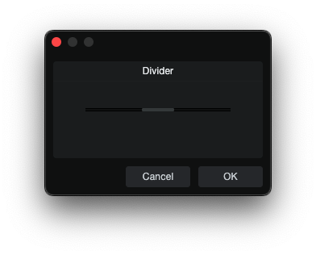</p> | <p align="center">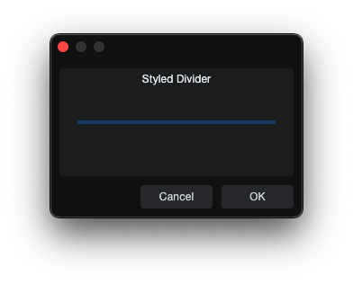</p> |

`Divider` is a visible separator control.

**skin.xml Snippet:**

```xml
<Styles>
  <Style name="DividerBlue" inherit="Standard.AddIn.Divider">
    <Color name="backcolor" color="#1F4E79"/>
  </Style>
</Styles>

<Divider name="DividerBlue" width="220" height="4" style="DividerBlue"/>
```

| Attribute Name | Description | Type |
|---|---|---|
| `attach` | Layout attachment/alignment. | token |
| `height` | Explicit height. | number |
| `name` | Divider binding name. | identifier |
| `options` | Visual or behavioral options.| token |
| `outreach` | Divider outreach amount. | number |
| `size` | Position and size geometry. | tuple |
| `style` | Style reference. | identifier |
| `margin` | Divider margin. | number |
| `width` | Explicit width. | number |

| **options** | Description |
|---|---|
| `horizontal` | Horizontal orientation. |
| `master` | - |
| `outreachbottom` | - |
| `outreachleft` | - |
| `outreachright` | - |
| `outreachtop` | - |
| `push` | - |
| `reverse` | - |
| `slave` | - |
| `small` | Small variant. |
| `transparent` | Transparent rendering. |
| `vertical` | Vertical orientation. |

### ProgressBar

<p align="center">
  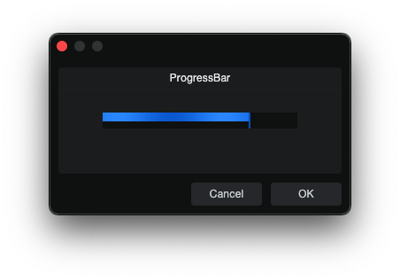
</p>

`ProgressBar` is a bound progress indicator used to show stepped or continuous
progress updates inside a dialog layout.

**skin.xml Snippet:**

```xml
<ProgressBar name="ProgressValue" width="140" height="18" options="horizontal"/>
```

**scriptname.js Snippet:**

```javascript
this.ProgressValue = context.parameters.addInteger(0, 100, "ProgressValue");
this.ProgressValue.value = 75;
```

| Attribute Name | Description | Type |
|---|---|---|
| `attach` | Layout attachment/alignment. | token |
| `height` | Explicit height. | number |
| `name` | ProgressBar binding name. | identifier |
| `options` | Orientation option. | token |
| `width` | Explicit width. | number |

| **options** | Description |
|---|---|
| `horizontal` | Horizontal ProgressBar. |

**Notes**

- `ProgressBar` can be driven by `addInteger(...)` or `addFloat(...)`.

### ActivityIndicator

<p align="center">
  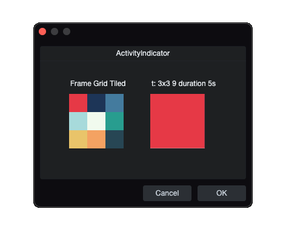
</p>

`ActivityIndicator` is an animated image playback control. It renders the style's foreground image and makes `Image` `frames` sprite-sheet animation values visible.

**skin.xml Snippet:**

```xml
<Image name="FrameGridTiled" url="images/example-frame-grid-3x3.png"
       frames="t: 3x3 9" duration="5 s"/>

<Style name="FrameGridTiledStyle">
  <Image name="foreground" image="FrameGridTiled"/>
</Style>

<ActivityIndicator width="90" height="90" style="FrameGridTiledStyle"/>
```

| Attribute Name | Description | Type |
|---|---|---|
| `attach` | Layout attachment/alignment. | token |
| `height` | Explicit height. | number |
| `name` | ActivityIndicator control name. | identifier |
| `options` | Rendering and update behavior. | token |
| `size` | Position and size geometry. | tuple |
| `style` | Style reference. | identifier |
| `tooltip` | Tooltip text. | text |
| `width` | Explicit width. | number |

| **options** | Description |
|---|---|
| `composited` | - |
| `directupdate` | - |
| `transparent` | - |

**Notes**

- `ActivityIndicator` uses a style that assigns an `Image` to the `foreground` slot.
- When that `Image` resource has `frames="t: ..."` and `duration`, the control plays the sprite-sheet animation.

## 5. Input Controls

### Button

| Plain | Host Styled |
|---|---|
| <p align="center">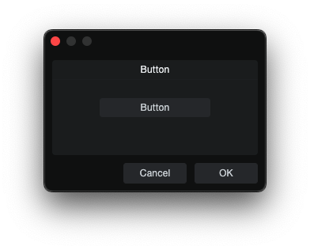</p> | <p align="center">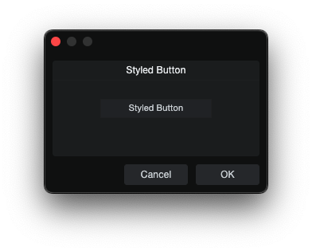</p> |

`Button` is a momentary action trigger.

**skin.xml Snippet:**

```xml
<Button name="Defaults" title="Reset Defaults" width="120" height="24"/>
```

**scriptname.js Snippet:**

```javascript
this.Defaults = context.parameters.addInteger(0, 1, "Defaults");
this.Defaults.value = 0;
```

| Attribute Name | Description | Type |
|---|---|---|
| `attach` | Layout attachment/alignment. | token |
| `height` | Explicit height. | number |
| `icon` | Overlay icon image resource. | identifier |
| `image` | Named image resource. | identifier |
| `localize` | Localization toggle. | flag |
| `name` | Button binding name. | identifier |
| `options` | Visual or layout options. | token |
| `size` | Position and size geometry. | tuple |
| `sizelimits` | Defines size limits. | tuple |
| `style` | Style reference. | identifier |
| `title` | Display title. | text |
| `titlename` | Title-binding name. | identifier |
| `tooltip` | Tooltip text. | text |
| `width` | Explicit width. | number |

| **options** | Description |
|---|---|
| `fittext` | - |
| `focus` | - |
| `hidefocus` | Suppresses focus chrome. |
| `hidetext` | Hide text area. |
| `immediate` | Immediate action. |
| `intermediate` | - |
| `ignoreimagesize` | Ignores image size. |
| `leadingicon` | - |
| `left` | Left visual segment drawing position. |
| `middle` | Middle visual segment drawing position. |
| `needsoptionkey` | - |
| `nocontextmenu` | Disable context menu. |
| `passive` | - |
| `right` | Right visual segment drawing position. |
| `trailingicon` | - |
| `transparent` | Transparent button. |
| `trigger` | Self-retriggering action. |


**Notes**

- `icon="ResourceName"` draws a named image resource on top of the button face.

### CheckBox

<p align="center">
  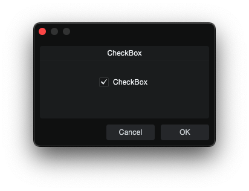
</p>

`CheckBox` is an independent on/off toggle.

**skin.xml Snippet:**

```xml
<CheckBox name="Enabled" value="0" title="Enabled"/>
```

**scriptname.js Snippet:**

```javascript
this.Enabled = context.parameters.addInteger(0, 1, "Enabled");
this.Enabled.value = 0;
```

| Attribute Name | Description | Type |
|---|---|---|
| `attach` | Layout attachment/alignment. | token |
| `height` | Explicit height. | number |
| `image` | Named image resource. | identifier |
| `localize` | Localization toggle. | flag |
| `name` | Checkbox binding name. | identifier |
| `options` | Visual or behavioral options. | token |
| `size` | Position and size geometry. | tuple |
| `sizelimits` | Defines size limits. | tuple |
| `style` | Style reference. | identifier |
| `title` | Display title. | text |
| `titlename` | Title-binding name. | identifier |
| `tooltip` | Tooltip text. | text |
| `value` | On/off state value. | number |
| `width` | Explicit width. | number |

| **options** | Description |
|---|---|
| `hidefocus` | Suppresses focus chrome. |
| `immediate` | Immediate action. |
| `momentary` | Momentary state. |
| `transparent` | - |
| `tristate` | - |

### RadioButton

<p align="center">
  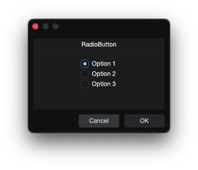
</p>

`RadioButton` is a mutually exclusive selector grouped by shared `name`.

**skin.xml Snippet:**

```xml
<RadioButton name="Mode" value="0" title="Option 1"/>
<RadioButton name="Mode" value="1" title="Option 2"/>
<RadioButton name="Mode" value="2" title="Option 3"/>
```

**scriptname.js Snippet:**

```javascript
this.Mode = context.parameters.addInteger(0, 2, "Mode");
this.Mode.value = 0;
```

| Attribute Name | Description | Type |
|---|---|---|
| `attach` | Layout attachment/alignment. | token |
| `height` | Explicit height. | number |
| `icon` | Overlay icon image resource. | identifier |
| `name` | Shared group binding name. | identifier |
| `options` | Visual and behavioral options. | token |
| `size` | Position and size geometry. | tuple |
| `sizelimits` | Defines size limits. | tuple |
| `style` | Style reference. | identifier |
| `title` | Display title. | text |
| `titlename` | Title-binding name. | identifier |
| `tooltip` | Tooltip text. | text |
| `value` | Assigned option value. | number |
| `width` | Explicit width. | number |


| **options** | Description |
|---|---|
| `hidefocus` | Suppresses focus chrome. |
| `immediate` | Immediate action. |
| `left` | - |
| `middle` | - |
| `nohelp` | - |
| `passive` | - |
| `right` | - |
| `toggle` | Toggle behavior.|
| `transparent` | - |
| `tristate` | - |

**Notes**

- `title` always renders to the right of the radio circle.

### Toggle

<p align="center">
  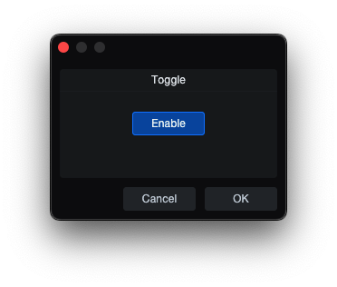
</p>

`Toggle` is an on/off button control.

**skin.xml Snippet:**

```xml
<Toggle name="Enable" title="Enable"/>
```

**scriptname.js Snippet:**

```javascript
this.Enable = context.parameters.addInteger(0, 1, "Enable");
this.Enable.value = 1;
```

| Attribute Name | Description | Type |
|---|---|---|
| `attach` | Layout attachment/alignment. | token |
| `height` | Explicit height. | number |
| `icon` | Overlay icon image resource. | identifier |
| `image` | Named image resource. | identifier |
| `name` | Toggle binding name. | identifier |
| `options` | Visual and behavior options. | token |
| `size` | Position and size geometry. | tuple |
| `sizelimits` | Defines size limits. | tuple |
| `style` | Style reference. | identifier |
| `title` | Display title. | text |
| `tooltip` | Tooltip text. | text |
| `value` | Assigned option value. | flag |
| `width` | Explicit width. | number |

| **options** | Description |
|---|---|
| `directupdate` | - |
| `fittext` | - |
| `hidefocus` | Suppresses focus chrome. |
| `immediate` | Immediate action. |
| `invert` | - |
| `leadingicon` | - |
| `left` | Left visual segment drawing position. |
| `middle` | Middle visual segment drawing position. |
| `momentary` | Momentary state flag. |
| `multiline` | - |
| `needsoptionkey` | - |
| `passive` | - |
| `right` | Right visual segment drawing position. |
| `scaletext` | - |
| `swipe` | - |
| `transparent` | - |
| `trigger` | Self-retriggering action. |

### ToolButton

<p align="center">
  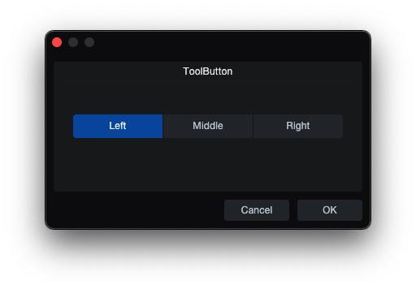
</p>

`ToolButton` is a segmented tool-style button control used for mutually exclusive selections and toggle actions grouped by shared `name`.

**skin.xml Snippet:**

```xml
<Horizontal margin="0" spacing="1" attach="left right">
  <ToolButton name="Mode" value="0" title="Left" 
              width="110" height="29" options="hidefocus left"/>
  <ToolButton name="Mode" value="1" title="Middle"
              width="110" height="29" options="hidefocus middle"/>
  <ToolButton name="Mode" value="2" title="Right"
              width="110" height="29" options="hidefocus right"/>
</Horizontal>
```

**scriptname.js Snippet:**

```javascript
this.Mode = context.parameters.addInteger(0, 2, "Mode");
```

| Attribute Name | Description | Type |
|---|---|---|
| `attach` | Layout attachment/alignment. | token |
| `height` | Explicit height. | number |
| `icon` | Overlay icon image resource. | identifier |
| `name` | ToolButton binding name. | identifier |
| `modename` | Mode binding name. | identifier |
| `options` | Button behavior tokens. | token |
| `sizelimits` | Position and size geometry. | tuple |
| `style` | Style reference. | identifier |
| `title` | Visible title text. | text |
| `tooltip` | Tooltip text. | text |
| `value` | Assigned option value. | number |
| `width` | Explicit width. | number |

| **options** | Description |
|---|---|
| `hidefocus` | Suppresses focus highlighting. |
| `immediate` | Immediate action. |
| `left` | Left visual segment drawing position. |
| `middle` | Middle visual segment drawing position. |
| `right` | Right visual segment drawing position. |
| `toggle` | Toggle behavior. |

**Notes**

- Wrap in `<Horizontal spacing="0">` to render it horizontally.
- `Left` `Middle` `Right` draw buttons as left, middle, or right segments, visual only.

### EditBox

| Plain | Host Styled |
|---|---|
| <p align="center">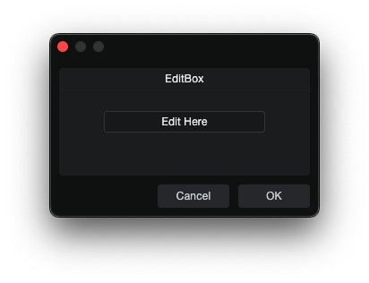</p> | <p align="center">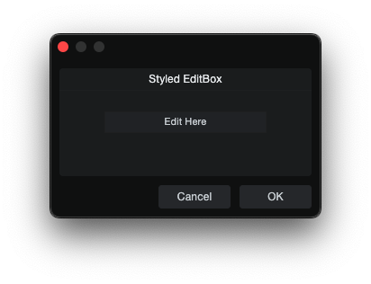</p> |

`EditBox` is an editable text field that accepts typed text and commits its value back to script.

**skin.xml Snippet:**

```xml
<EditBox name="InputText" width="180" height="22"/>
```

**scriptname.js Snippet:**

```javascript
this.InputText = context.parameters.addString("InputText");
this.InputText.value = "";
```

| Attribute Name | Description | Type |
|---|---|---|
| `attach` | Layout attachment/alignment. | token |
| `colorname` | Color-binding name. | identifier |
| `value` | Initial field value. | text |
| `localize` | Localization toggle. | flag |
| `name` | EditBox binding name. | identifier |
| `height` | Explicit height. | number |
| `options` | Visual and behavioral options. | token |
| `placeholder` | Placeholder text. | text |
| `size` | Position and size geometry. | tuple |
| `sizelimits` | Defines size limits. | tuple |
| `style` | Style reference. | identifier |
| `texttrimmode` | Text trimming mode. | token |
| `title` | Display title. | text |
| `tooltip` | Tooltip text. | text |
| `width` | Explicit width. | number |

| **options** | Description |
|---|---|
| `border` | Visible field border. |
| `dialogedit` | - |
| `doubleclick` | - |
| `email` | Email input field. |
| `extended` | Extended editing. |
| `focus` | - |
| `fittext` | Fit text. |
| `hidefocus` | Suppresses focus chrome. |
| `immediate` | - |
| `markup` | - |
| `multiline` | Multi-line edit mode. |
| `musthittext` | - |
| `password` | Password input field. |
| `scaletext` | - |
| `vertical` | Enables vertical overflow/scrollbar behavior. |
| `transparent` | Transparent edit background. |


**Notes**

- EditBox text can be prefilled by setting the parameter `.value` before the dialog opens.
- For multiline `EditBox` controls, apply a style alignment such as `<Align name="textalign" align="left top"/>`.
- Use `options="multiline vertical"` with long overflow content for visible edit/focus-state scrollbar behavior.

### ValueBox

<p align="center">
  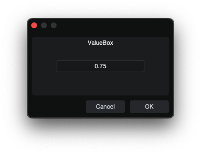
</p>

`ValueBox` is an editable value field that can accept typed values and can be
written back from script.

**skin.xml Snippet:**

```xml
<ValueBox name="ValueText" width="140" height="22"/>
```

**scriptname.js Snippet:**

```javascript
this.ValueText = context.parameters.addString("ValueText");
this.ValueText.value = "";
```

| Attribute Name | Description | Type |
|---|---|---|
| `attach` | Layout attachment/alignment. | token |
| `height` | Explicit height. | number |
| `colorname` | Color-binding name. | identifier |
| `labelname` | Label-binding name. | identifier |
| `localize` | Localization toggle. | flag |
| `name` | ValueBox binding name. | identifier |
| `options` | Visual or behavioral options.| token |
| `size` | Position and size geometry. | tuple |
| `sizelimits` | Defines size limits. | tuple |
| `style` | Style reference. | identifier |
| `tooltip` | Tooltip text. | text |
| `units` | Display unit. | identifier |
| `width` | Explicit width. | number |
| `xyediting` | Vertical drag sensitivity. | number |

| **options** | Description |
|---|---|
| `dialogedit` | - |
| `doubleclick` | Double-click behavior. |
| `fittext` | Fit text. |
| `hidefocus` | Hide focus. |
| `hidetext` | Hide text area. |
| `inversewheel` | Invert wheel direction. |
| `nodrag` | Disable drag. | 
| `nowheel` | Disable mousewheel interaction. |
| `scaletext` | Scale text. |
| `transparent` | Transparent rendering. |

**Notes**

- ValueBox can be prefilled by setting the parameter `.value` before the dialog opens.
- It can display a user-facing unit while the script stores a different underlying unit; see [README.md section 18.4](../../README.md#184-crossfade-tool--complete-working-example).

### Slider

| Plain | Host Styled |
|---|---|
| <p align="center">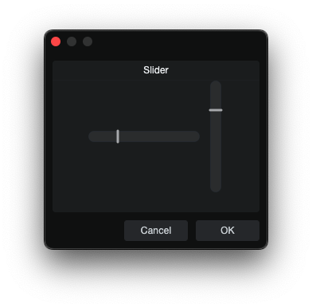</p> | <p align="center">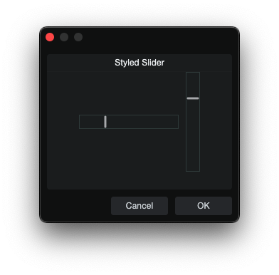</p> |

`Slider` is a slider control.

**skin.xml Snippet:**

```xml
<Horizontal spacing="2" attach="left right">
  <Slider name="TimeSlider" width="100" height="20"
          options="horizontal" style="Standard.AddIn.Slider"/>
  <EditBox name="TimeSlider" width="45" height="20"/>
  <Label title="ms"/>
</Horizontal>
```

**scriptname.js Snippet:**

```javascript
this.TimeSlider = context.parameters.addFloat(-1, 1, "TimeSlider");
this.TimeSlider.value = -0.25;
```

| Attribute Name | Description | Type |
|---|---|---|
| `attach` | Layout attachment/alignment. | token |
| `height` | Explicit height. | number |
| `mode` | Slider interaction mode. | identifier |
| `name` | Slider binding name. | identifier |
| `colorname` | Color-binding name. | identifier |
| `options` | Visual and behavioral options. | token |
| `size` | Position and size geometry. | tuple |
| `sizelimits` | Defines size limits. | tuple |
| `style` | Style reference. | identifier |
| `title` | Display title. | text |
| `tooltip` | Tooltip text. | text |
| `width` | Explicit width. | number |
| `xyediting` | Vertical drag sensitivity. | number |

| **mode** | Description |
|---|---|
| `relative` | - |

| **options** | Description |
|---|---|
| `bargraph` | - |
| `centered` | - |
| `composited` | - |
| `directupdate` | - |
| `globalmode` | - |
| `horizontal` | Horizontal slider. |
| `passive` | - |
| `thinhandle` | Thin-handle |
| `tickscale` | - |
| `tooltip` | Value adjustment tooltip. |
| `vertical` | Vertical slider. |
| `transparent` | Transparent slider. |
| `xyediting` | Allows vertical drag adjustment. |

### RangeSlider

<p align="center">
  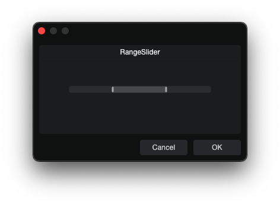
</p>

`RangeSlider` is a dual-handle slider used to control a start and end value.

**skin.xml Snippet:**

```xml
<RangeSlider name="RangeStart" name2="RangeEnd" 
             width="240" height="14"
             options="bargraph horizontal tooltip" attach="vcenter"/>
```

**scriptname.js Snippet:**

```javascript
this.RangeStart = context.parameters.addFloat(0, 1, "RangeStart");
this.RangeEnd = context.parameters.addFloat(0, 1, "RangeEnd");
this.RangeStart.value = 0.25;
this.RangeEnd.value = 0.75;
```

| Attribute Name | Description | Type |
|---|---|---|
| `attach` | Layout attachment. | token |
| `name` | Primary binding name. | identifier |
| `name2` | Secondary binding name. | identifier |
| `options` | Visual and behavioral options. | token |
| `size` | Position and size geometry. | tuple |
| `style` | Style Reference. | identifier |
| `width` | Explicit width. | number |

| **options** | Description |
|---|---|
| `bargraph` | - |
| `directupdate` | Updates value directly while dragging. |
| `horizontal` | Horizontal slider. |
| `invertible` | Allows inverted slider behavior. |
| `tooltip` | Value adjustment tooltip. |
| `xyediting` | Allows vertical drag adjustment. |

### Knob

<p align="center">
  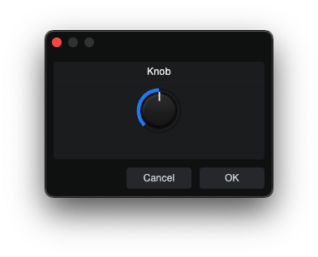
</p>

`Knob` is a rotary control.

**skin.xml Snippet:**

```xml
<Vertical spacing="5">
  <Knob name="MyKnob" width="60" height="60"/>
  <ValueBox name="MyKnobDisplay" width="60" height="20"/>
</Vertical>
```

**scriptname.js Snippet:**

```javascript
this.MyKnob = context.parameters.addInteger(0, 127, "MyKnob");
this.MyKnobDisplay = context.parameters.addString("MyKnobDisplay");
this.MyKnobDisplay.value = String(this.MyKnob.value);
```

| Attribute Name | Description | Type |
|---|---|---|
| `attach` | Layout attachment/alignment. | token |
| `height` | Explicit height. | number |
| `name` | Knob binding name. | identifier |
| `options` | Visual or behavioral options. | token |
| `colorname` | Color-binding name. | identifier |
| `referencename` | Reference binding name. | identifier |
| `size` | Position and size geometry. | tuple |
| `style` | Style reference. | identifier |
| `tooltip` | Tooltip text. | text |
| `width` | Explicit width. | number |

| **options** | Description |
|---|---|
| `centered` | - |
| `inversewheel` | Inverted mousewheel scroll. |
| `passive` | Passive knob adjustment behavior. |
| `reverse` | Reverse value direction. |
| `tooltip` | Value adjustment tooltip. |
| `vertical` | - |

### ColorBox

<p align="center">
  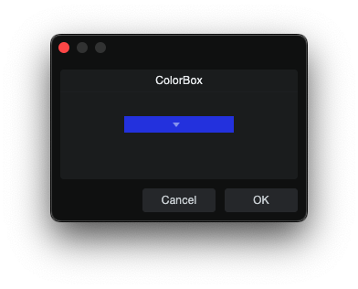
</p>

`ColorBox` is a compound color picker that requires a nested `SelectBox` to
render its popup and bound color value.

**skin.xml Snippet:**

```xml
<ColorBox name="Color1" width="120" height="18" attach="hcenter vcenter">
  <SelectBox name="Color1" width="120" height="18"
             options="border transparent hidetext hidefocus"/>
</ColorBox>
```

**scriptname.js Snippet:**

```javascript
this.Color1 = context.parameters.addColor("Color1");
this.Color1.palette = Host.Engine.TrackColorPalette;
this.Color1.value = 0xFF2F4DE4;
```

| Attribute Name | Description | Type |
|---|---|---|
| `attach` | Layout attachment/alignment. | token |
| `height` | Explicit height. | number |
| `name` | ColorBox binding name. | identifier |
| `options` | Visual and behavioral options. | token |
| `radius` | Corner radius. | number |
| `size` | Position and size geometry. | tuple |
| `style` | Style reference. | identifier |
| `tooltip` | Tooltip text. | text |
| `width` | Explicit width. | number |

| **options** | Description |
|---|---|
| `border` | Visible field border. |
| `nowheel` | Disable mousewheel interaction. |

### ComboBox

| Plain | Local Styled |
|---|---|
| <p align="center">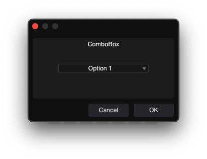</p> | <p align="center">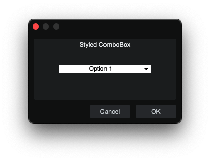</p> |

`ComboBox` is a dropdown selector for choosing one item from a list of
script-provided values.

**skin.xml Snippet:**

```xml
<Styles>
  <Style name="ComboColor">
    <Color name="backcolor" color="#FFFFFF"/>
    <Color name="textcolor" color="#000000"/>
  </Style>
</Styles>

<ComboBox name="Choice" width="180" style="ComboColor"/>
```

**scriptname.js Snippet:**

```javascript
this.Choice = context.parameters.addList("Choice");
this.Choice.appendString("Option 1");
this.Choice.appendString("Option 2");
this.Choice.value = 0;
```

| Attribute Name | Description | Type |
|---|---|---|
| `attach` | Layout attachment/alignment. | token |
| `editname` | Associated editable field binding. | identifier |
| `height` | Explicit height. | number |
| `name` | ComboBox binding name. | identifier |
| `options` | Visual and behavioral options. | token |
| `size` | Position and size geometry. | tuple |
| `style` | Style reference. | identifier |
| `tooltip` | Tooltip text. | text |
| `width` | Explicit width. | number |

| **options** | Description |
|---|---|
| `border` | Visible field border. |
| `doubleclick` | - |
| `fittext` | Fit text. |
| `hidefocus` | Suppresses focus chrome. |
| `ignorekeys` | Ignore keys. |
| `nowheel` | Disable mousewheel interaction. |
| `stayopenonclick` | Keep popup open on click. |
| `translucent` | Translucent rendering. |
| `transparent` | Transparent ComboBox. |

**Notes**

- Population uses `addList()` plus `appendString()`.
- See the main README [ParamList section](../../README.md#112-system-2-cclparamlist-persistent-dialog-panel) for `addList()` and `appendString()`.

### SelectBox

| Plain | Host Styled |
|---|---|
| <p align="center">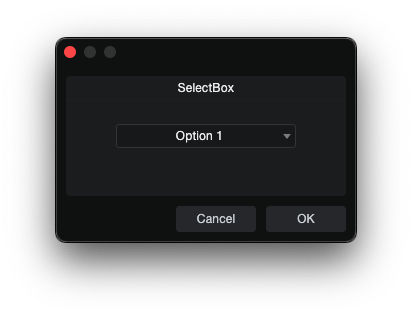</p> | <p align="center">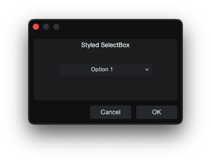</p> |

`SelectBox` is a taller dropdown selector than `ComboBox`, intended for
list-style selection in dialogs.

**skin.xml Snippet:**

```xml
<SelectBox name="Choice" width="180" style="Standard.AddIn.SelectBox"/>
```

**scriptname.js Snippet:**

```javascript
this.Choice = context.parameters.addList("Choice");
this.Choice.appendString("Option 1");
this.Choice.appendString("Option 2");
this.Choice.value = 0;
```

| Attribute Name | Description | Type |
|---|---|---|
| `attach` | Layout attachment/alignment. | token |
| `height` | Explicit height. | number |
| `name` | SelectBox binding name. | identifier |
| `options` | Visual and behavioral options. | token |
| `popupstyle` | Popup style reference. | identifier |
| `localize` | Localization toggle. | flag |
| `popup` | Popup binding name. | identifier |
| `size` | Position and size geometry. | tuple |
| `sizelimits` | Defines size limits. | tuple |
| `style` | Style reference. | identifier |
| `title` | Display title. | text |
| `texttrimmode` | Text trimming mode. | token |
| `value` | Assigned value. | number |
| `tooltip` | Tooltip text. | text |
| `width` | Explicit width. | number |

| **options** | Description |
|---|---|
| `border` | Visible field border. |
| `fittext` | Fit text. |
| `hidebutton` | Hides the dropdown button. |
| `hidefocus` | Hides focus chrome. |
| `hidetext` | Hide text area. |
| `ignorekeys` | Ignore keys. |
| `inversewheel` | Invert wheel direction. |
| `leadingbutton` | Places button at leading edge. |
| `left` | - |
| `nocontextmenu` | Disable context menu. |
| `nohelp` | - |
| `nomodifier` | Suppress modifier-key. |
| `nowheel` | Disable mousewheel interaction. |
| `offstate` | - |
| `scaletext` | - |
| `showtitle` | - |
| `stayopenonclick` | Keep popup open on click. |
| `trailingbutton` | Places button at trailing edge. |
| `transparent` | Transparent background. |

**Notes**

- Population uses `addList()` plus `appendString()`.
- See the main README [ParamList section](../../README.md#112-system-2-cclparamlist-persistent-dialog-panel) for `addList()` and `appendString()`.

## 6. Collection & Navigation Controls

### ListView

`ListView` is a table-style UI element that displays rows from a `Host:ListViewModel`.

**skin.xml Snippet:**

```xml
<ListView name="list" height="400" width="500"/>
```

| Attribute Name | Description | Type |
|---|---|---|
| `attach` | Layout attachment/alignment. | token |
| `height` | Explicit height. | number |
| `headerstyle` | Header style reference. | identifier |
| `hscroll.style` | Horizontal scrollbar style reference. | identifier |
| `name` | Binds to the controller-owned `Host:ListViewModel` property. | identifier |
| `options` | Visual and behavioral options. | token |
| `persistence.id` | Persistent layout state key. | identifier |
| `scrolloptions` | Scrollbar rendering. | token |
| `size` | Position and size geometry. | tuple |
| `sizelimits` | Defines size limits. | tuple |
| `style` | Style reference. | identifier |
| `viewtype` | View presentation mode. | identifier |
| `vscroll.style` | Vertical scrollbar style reference. | identifier |
| `title` | Display title. | text |
| `tooltip` | Tooltip text. | text |
| `width` | Explicit width. | number |

| **options** | Description |
|---|---|
| `columnfocus` | - |
| `exclusive` | Enables exclusive selection behavior. |
| `extendlastcolumn` | - |
| `header` | Shows the header row. |
| `hide` | - |
| `mousescroll` | - |
| `nodoubleclick` | - |
| `nodrag` | Disables dragging. |
| `nofocus` | - |
| `nolinebreak` | - |
| `nounselect` | - |
| `norubber` | - |
| `resizedraw` | - |
| `selection` | Enables row selection behavior. |
| `simplemouse` | - |
| `swallowalphachars` | - |
| `thumbnails` | - |
| `translucent` | - |
| `transparent` | - |
| `vertical` | - |

| **scrolloptions** | Description |
|---|---|
| `autobuttonsh` | Auto button show/hide. |
| `autohideboth` | Auto-hide both scrollbars. |
| `autohideh` | Auto-hide horizontal scrollbar. |
| `autohidev` | Auto-hide vertical scrollbar. |
| `border` | Scrollbar border. |
| `horizontal` | Renders horizontal scrollbar. |
| `noscreenscroll` | Disables screen scrolling. |
| `small` | Uses smaller UI metrics. |
| `transparent` | Renders transparent background. |
| `vertical` | Renders vertical scrollbar. |

**Notes**

- The controller must expose a `list` property containing the `Host:ListViewModel` instance.
- See the main README [ListView section](../../README.md#114-listview-hostlistviewmodel) for the documented `Host:ListViewModel` binding path.

## 7. Style Helpers & Host Styles

### Style

`Style` defines one reusable style rule, optionally inheriting from a host style.

**skin.xml Snippet:**

```xml
<Style name="MyEditBox" inherit="Standard.AddIn.EditBox">
  <Color name="backcolor" color="#1A1A2E"/>
  <Color name="textcolor" color="#FFFFFF"/>
</Style>
```

| Attribute Name | Description | Type |
|---|---|---|
| `appstyle` | - | flag |
| `backcolor` | Style background color. | color |
| `border` | Style border mode and width. | number |
| `forecolor` | Style foreground color. | color |
| `name` | Style identifier. | identifier |
| `inherit` | Style to inherit from. | identifier |
| `override` | Overrides inherited style values. | token |
| `textalign` | Text alignment setting. | token |
| `textcolor` | Style text color. | color |
| `textoptions` | Text rendering options. | token |
| `textsize` | Text size. | number |
| `textstyle` | Text style setting. | token |
| `textthemeid` | Theme identifier for text styling. | identifier |

| **appstyle** | Description |
|---|---|
| `true` | - |

| **override** | Description |
|---|---|
| `true` | - |

| **textalign** | Description |
|---|---|
| `center` | Center aligned text. |
| `left` | Left aligned text. |
| `top` | Top aligned text. |
| `vcenter` | Vertical center aligned text. |

| **textoptions** | Description |
|---|---|
| `wordbreak` | - |

| **textstyle** | Description |
|---|---|
| `underline` | - |

| **textthemeid** | Description |
|---|---|
| `StandardUI` | - |

### Host Styles

Host styles are named skin recipes that change chrome, spacing, embedded
affordances, or visual variants while script still handles behavior through
bound params and controller methods.

| Style | Used On | Observed Effect | Notes |
|---|---|---|---|
| `Standard.SearchBox` | `ImageView`, `EditBox`, `Button` | Native search field chrome with embedded clear button slot | Works with `searchString` + `clear` binding |
| `Standard.LabelDimmed` | `Label` | Dimmed placeholder label styling | Used inside `Standard.SearchBox` |
| `Standard.WindowHeaderView` | `Form` | Native window header / outer dialog chrome | Works with script buttons for Min/Max/Close |
| `Standard.WindowMinimizeButton` | `Button` | Native minimize icon/button chrome | Visual chrome only |
| `Standard.WindowMaximizeButton` | `Toggle` | Native maximize icon/button chrome | Visual chrome only |
| `Standard.WindowCloseButton` | `Button` | Native close icon/button chrome | Visual chrome only |
| `Standard.MenuBackcolorStyle` | `Form` | CommandBar menu-style background chrome | - |
| `Standard.Menu.MenuHeader` | `View` | CommandBar menu header chrome | - |
| `Standard.Menu.MenuHeaderEditBox` | `EditBox` | CommandBar menu header edit styling | - |
| `Standard.Menu.MenuHeaderCheckBox` | `CheckBox` | CommandBar menu header checkbox styling | - |
| `Standard.AddIn.Title` | `Label` | Larger bold title text | Visual only |
| `Standard.AddIn.Label` | `Label` | Add-in label theme | Visual only |
| `Standard.AddIn.Button` | `Button` | Add-in button theme | Visual only |
| `Standard.AddIn.ButtonL` | `Button` | Left-edge button variant | Visual only |
| `Standard.AddIn.ButtonC` | `Button` | Center button variant | Visual only |
| `Standard.AddIn.ButtonR` | `Button` | Right-edge button variant | Visual only |
| `Standard.AddIn.ComboBox` | `ComboBox` | Add-in combo-box theme | Visual only |
| `Standard.AddIn.Divider` | `Divider` | Add-in divider style | Visual only |
| `Standard.AddIn.EditBox` | `EditBox` | Add-in edit-field theme | Visual only |
| `Standard.AddIn.Group` | `View` | Add-in group/fieldset style | Visual only |
| `Standard.AddIn.Knob` | `Knob` | Add-in knob theme | Visual only |
| `Standard.AddIn.SectionDividerH` | `Divider` | Add-in horizontal section divider style | Visual only |
| `Standard.AddIn.SectionDividerV` | `Divider` | Add-in vertical section divider style | Visual only |
| `Standard.AddIn.SelectBox` | `SelectBox` | Add-in select-box theme | Visual only |
| `Standard.AddIn.Slider` | `Slider` | Add-in slider theme | Visual only |
| `Standard.CheckBox` | `CheckBox` | Base checkbox theme | Visual only |
| `Standard.ColorPickerPalette` | `SelectBox` | Base color-picker palette style | Visual only |
| `Standard.ComboBox` | `ComboBox` | Base combo-box theme | Visual only |
| `Standard.EditBox` | `EditBox` | Base edit-field theme | Visual only |
| `Standard.Label` | `Label` | Base label theme | Visual only |
| `Standard.Link` | `Link` | Base link theme | Visual only |
| `Standard.ListView` | `ListView` | Base list-view skin | Visual only |
| `Standard.MenuControl` | `View` | Base menu-control styling | Visual only |
| `Standard.SelectBox` | `SelectBox` | Base select-box theme | Visual only |
| `Standard.TextBox` | `TextBox` | Base text-box theme | Visual only |
| `Standard.TreeView` | `TreeView` | Base tree-view skin | Visual only |

### Align

<p align="center">
  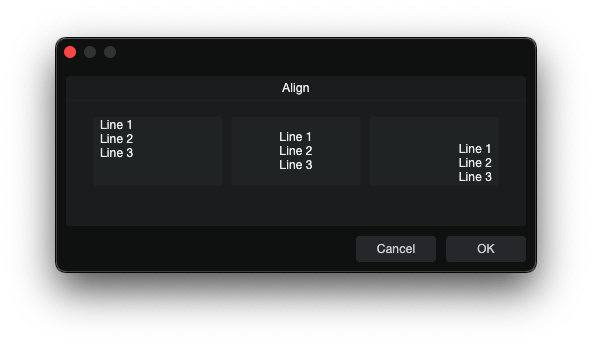
</p>

`Align` is a style helper that sets text alignment on controls that support it.

**skin.xml Snippet:**

```xml
<Styles>
  <Style name="AlignCenterEditBox" inherit="Standard.AddIn.EditBox">
    <Align name="textalign" align="center"/>
  </Style>
  <Style name="AlignRightTopEditBox" inherit="Standard.AddIn.EditBox">
    <Align name="textalign" align="right top"/>
  </Style>
</Styles>
```

| Attribute Name | Description | Type |
|---|---|---|
| `align` | Alignment options. | token |
| `name` | - | identifier |

**Notes**

- `Align` is used inside `<Style>` definitions. For the parameter-side population patterns used by the tested controls, see the main README [ParamList section](../../README.md#112-system-2-cclparamlist-persistent-dialog-panel).
- Confirmed working for `EditBox`, `ValueBox`, `TextBox`, `SelectBox`, and `ComboBox`.

### Color

`Color` defines a named color slot inside a style.

**skin.xml Snippet:**

```xml
<Color name="textcolor" color="#FFFFFF"/>
```

| Attribute Name | Description | Type |
|---|---|---|
| `name` | Color role name. | identifier |
| `color` | Assigned color value. | color |

| **name** | Description |
|---|---|
| `backcolor.off` | Background color for the off state. |
| `backcolor.on` | Background color for the on state. |
| `backcolor` | Background color. |
| `linkcolor` | Link text color. |
| `forecolor` | Foreground color. |
| `selectedtextcolor` | Text color used for selected content. |
| `textcolor.on` | Text color for the on state. |
| `textcolor` | Primary text color. |

### Font

`Font` defines a named font slot inside a style.

**skin.xml Snippet:**

```xml
<Font name="textfont" themeid="PresonusUI" size="13" bold="true"/>
```

| Attribute Name | Description | Type |
|---|---|---|
| `face` | - | identifier |
| `name` | - | token |
| `size` | Font size. | number |
| `spacing` | Font space. | number |
| `style` | Font style options. | token |
| `themeid` | - | identifier |
| `smoothing` | - | token |
| **name** | Description |
|---|---|
| `textfont` | - |

| **smoothing** | Description |
|---|---|
| `antialias` | - |

| **style** | Description |
|---|---|
| `bold` | Bold font weight. |
| `italic` | Italic font style. |
| `normal` | Normal font weight. |
| `underline` | Underlined text. |

## 8. Image & Shape Resources

### Image

<p align="center">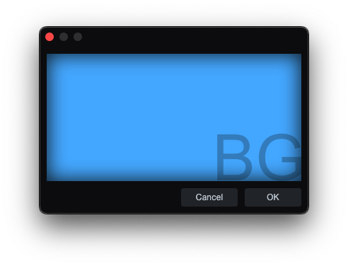</p>

`Image` defines a named image resource.

**skin.xml Snippet:**

```xml
<Image name="BG1" url="images/BG1.png"/>

<Form name="ImageBackgroundTest" image="BG1">
  <!-- Form content -->
</Form>
```

| Attribute Name | Description | Type |
|---|---|---|
| `adaptive` | - | flag |
| `duration` | Total animation cycle time. | time |
| `frames` | Frame sequence. | token |
| `image` | - | identifier |
| `margin` | Image margin. | tuple |
| `name` | Image resource name. | identifier |
| `size` | Image size geometry. | tuple |
| `template` | - | flag |
| `tile` | Tiling mode. | token |
| `url` | Asset path for the image resource. | identifier |

| **adaptive** | Description |
|---|---|
| `true` | - |

| **frames** | Description |
|---|---|
| `normal` | Default image frame. |
| `normalOn` | On-state frame. |
| `normal0 normal1 normal2` | - |
| `t: *x* *` | Tiled sprite-sheet frame expression. |

| **template** | Description|
|---|---|
| `true` | - |

| **tile** | Description |
|---|---|
| `repeat-xy` | - |
| `stretch-xy` | - |
| `stretch-y` | - |
| `tile-x` | - |
| `tile-xy` | - |

**Notes**

- `url` is used for image assets such as PNG and SVG files in the package.
- For `t:` sprite sheets, `3x3` is the sprite-sheet grid size and the value after the space is the active frame count. In `t: 3x3 8`, the animation plays frames `1` through `8` and then loops back to `1`.
- `duration` sets the total time for one full animation cycle across the active frames.

### ImagePart

`ImagePart` defines a named crop or state frame from an `Image` resource, used for atlas slicing and button/state graphics.

**skin.xml Snippet:**

```xml
<Image name="ButtonOffImage">
  <ImagePart name="normal" image="ButtonStateSheet" size="0,0,120,36"/>
</Image>

<Image name="ButtonHoverImage">
  <ImagePart name="normal" image="ButtonStateSheet" size="0,36,120,36"/>
</Image>
```

| Attribute Name | Description | Type |
|---|---|---|
| `duration` | Total animation cycle time. | time |
| `frames` | Frame/state sequence. | token |
| `image` | Referenced `Image` resource name. | identifier |
| `margin` | Crop margin. | tuple |
| `name` | ImagePart resource name. | identifier |
| `size` | Crop geometry | tuple |
| `tile` | Tiling mode. | token |
| `template` | - | - |
| `url` | Asset path for the image part. | - |

| **frames** | Description |
|---|---|
| `darkframe` | - |
| `disabled` | - |
| `h:` | Horizontal frame set prefix. |
| `lightframe` | - |
| `mouseover` | - |
| `mouseoverOn` | - |
| `normal` | - |
| `normalOn` | - |
| `phaseOn` | - |
| `pressed` | - |
| `v:` | Vertical frame set prefix. |
| `disabledOn` | - |
| `normal0` | - |
| `normal1` | - |
| `normal2` | - |
| `pressedOn` | - |
| `small` | - |

| **tile** | Description |
|---|---|
| `repeat-x` | - |
| `repeat-xy` | - |
| `repeat-y` | - |
| `stretch-xy` | - |
| `stretch-y` | - |
| `tile-x` | - |
| `tile-xy` | - |
| `tile-y` | - |

**Notes**

- `ImagePart` is used to carve out a sub-rectangle from a named image resource, including button-state atlases and other sliced UI image sheets.
- The wrapped `Image` name is what other controls consume; the `ImagePart` supplies the cropped state slice inside it.

### ImageFilter

`ImageFilter` defines a named filter for an `ImagePart`.

**skin.xml Snippet:**

```xml
<ImageFilter name="colorize" color="hsl(220,80,45)"/>
```

| Attribute Name | Description | Type |
|---|---|---|
| `name` | Filter type. | token |
| `color` | Filter color value. | color |
| `value` | Numeric filter value. | number |

| **name** | Description |
|---|---|
| `blend` | Blend filter. |
| `colorize` | Colorize filter. |
| `lightadapt` | - |
| `tint` | Tint filter. |

### Shape

<p align="center">
  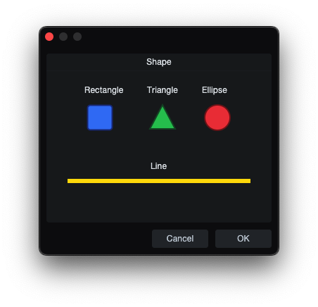
</p>

`Shape` defines one named vector object inside a top-level `Shapes` block.

**skin.xml Snippet:**

```xml
<Shape name="RoundedSquareShape" size="0,0,48,48" style="scale">
  <Rectangle size="4,4,40,40" style="fill stroke tiled margin"
             Brush.color="hsl(204,11,64)"
             Pen.color="hsl(0,0,12)"
             Pen.width="2"
             radius="6"/>
</Shape>
```

| Attribute Name | Description | Type |
|---|---|---|
| `name` | Shape resource name. | identifier |
| `size` | Size geometry. | tuple |
| `style` | - | token |

| **name** | Description |
|---|---|
| `disabled` | - |
| `focus` | - |
| `mouseover` | - |
| `normal` | - |
| `normalOn` | - |
| `pressed` | - |
| `pressedOn` | - |

| **style** | Description |
|---|---|
| `scale` | - |

### ShapeImage

`ShapeImage` exposes a named `Shape` as an image resource.

**skin.xml Snippet:**

```xml
<ShapeImage name="RoundedSquareIcon" url="RoundedSquareShape"/>
```

| Attribute Name | Description | Type |
|---|---|---|
| `adaptive` | - | flag |
| `name` | ShapeImage resource name. | identifier |
| `margin` | - | tuple |
| `url` | Referenced `Shape` name. | identifier |
| `frames` | - | number |
| `template` | - | token |

| **adaptive** | Description |
|---|---|
| `true` | - |

| **frames** | Description |
|---|---|
| `embedded` | - |

| **name** | Description |
|---|---|
| `mouseover` | - |
| `mouseoverOn` | - |
| `normal` | - |
| `normalOn` | - |
| `pressed` | - |
| `pressedOn` | - |

### Rectangle

`Rectangle` is a rectangle primitive used inside `Shape`.

**skin.xml Snippet:**

```xml
<Rectangle size="4,4,40,40" style="fill stroke tiled margin"
           Brush.color="hsl(204,11,64)"
           Pen.color="hsl(0,0,12)"
           Pen.width="2" radius="6"/>
```

| Attribute Name | Description | Type |
|---|---|---|
| `size` | Position and size geometry. | tuple |
| `style` | Rectangle drawing style. | token |
| `Brush.color` | Fill color. | color |
| `Brush.gradient` | Fill gradient reference. | identifier |
| `Pen.color` | Stroke color. | color |
| `Pen.width` | Stroke width. | number |
| `radius` | Rounded corner radius. | number |

**style**

| Values | Description |
|---|---|
| `fill` | Enable fill. |
| `margin` | - |
| `scale` | - |
| `stroke` | Enable stroke line. |
| `tiled` | -|

### Triangle

`Triangle` is a triangle primitive used inside `Shape`.

**skin.xml Snippet:**

```xml
<Triangle point1="24,6" point2="42,40" point3="6,40" style="fill stroke" 
          Brush.color="hsl(204,11,64)"
          Pen.color="hsl(0,0,12)" 
          Pen.width="2"/>
```

| Attribute Name | Description | Type |
|---|---|---|
| `point1` | First triangle point. | tuple |
| `point2` | Second triangle point. | tuple |
| `point3` | Third triangle point. | tuple |
| `style` | Triangle drawing style. | token |
| `Brush.color` | Fill color. | color |
| `Pen.color` | Stroke color. | color |
| `Pen.width` | Stroke width. | number |

| **name** | Description |
|---|---|
| `normal` | - |

**style**

| Values | Description |
|---|---|
| `fill` | Enable fill. |
| `stroke` | Enable stroke line. |

**Notes** 

- `point1` `point2` `point3` use two value-tuple "x,y". 

### Ellipse

`Ellipse` is an ellipse/circle primitive used inside `Shape`.

**skin.xml Snippet:**

```xml
<Ellipse size="6,6,36,36" style="fill stroke" 
         Brush.color="hsl(204,11,64)"
         Pen.color="hsl(0,0,12)"
         Pen.width="2"/>
```

| Attribute Name | Description | Type |
|---|---|---|
| `size` | Position and size geometry. | tuple |
| `style` | Ellipse drawing style. | token |
| `Brush.color` | Fill color. | color |
| `Pen.color` | Stroke color. | color |
| `Pen.width` | Stroke width. | number |

**style**

| Values | Description |
|---|---|
| `fill` | Enable fill. |
| `stroke` | Enable stroke line. |

### Line

`Line` is a line primitive used inside `Shape`.

**skin.xml Snippet:**

```xml
<Line start="0,0" end="10,0" style="stroke"
      Pen.color="hsl(204,11,64)"
      Pen.width="2"/>
```

| Attribute Name | Description | Type |
|---|---|---|
| `start` | Line start point. | tuple |
| `end` | Line end point. | tuple |
| `style` | Line drawing styles. | token |
| `scalealign` | - | token |
| `Pen.color` | Stroke color. | color |
| `Pen.width` | Stroke width. | number |

| **style** | Description |
|---|---|
| `stroke` | Enable stroke line. |
| `tiled` | - |

| **scalealign** | Description |
|---|---|
| `bottom` | - |
| `right` | - |

**Notes**

- `start` and `end` use a two-value tuple "x,y"

## 9. Skin.xml Index

### 9.1 Top-Level Elements

| Element | Purpose |
|---|---|
| `External` | One imported namespace pattern |
| `Externals` | Container for imported host namespaces |
| `Form` | One dialog/window definition |
| `Forms` | Container for dialog definitions |
| `Resources` | Container for named reusable assets |
| `Shapes` | Container for named vector shape resources |
| `Skin` | Root container for the entire `skin.xml` document |
| `Styles` | Container for custom style definitions |

### 9.2 Confirmed Elements

| Element | Category | Binds To |
|---|---|---|
| `ActivityIndicator` | Text & Display | Image animation resource |
| `Align` | Style Helpers | `Style` definitions |
| `CheckBox` | Input Controls | `addInteger(0,1,...)` |
| `Color` | Style Helpers | - |
| `ColorBox` | Input Controls | `addColor` |
| `ComboBox` | Input Controls | `addList` |
| `define` | Template & Control Flow | - |
| `DialogGroup` | Layout Containers | - |
| `Divider` | Text & Display | - |
| `EditBox` | Input Controls | `addString`, `addInteger`, `addFloat` |
| `Ellipse` | Image & Shape Resources | Nested in `Shape` |
| `External` | Document Structure | - |
| `Externals` | Document Structure | - |
| `Font` | Style Helpers | - |
| `Form` | Document Structure | - |
| `Forms` | Document Structure | - |
| `Horizontal` | Layout Containers | - |
| `if` | Template & Control Flow | Host/controller property |
| `Image` | Image & Shape Resources | Referenced by `ImageView` / styles |
| `ImageFilter` | Image & Shape Resources | Nested in `ImagePart` |
| `ImagePart` | Image & Shape Resources | Referenced by `ImageView` |
| `ImageView` | Text & Display | - |
| `Knob` | Input Controls | `addInteger`, `addFloat` |
| `Label` | Text & Display | - |
| `Link` | Text & Display | `addParam(...)`, `paramChanged(...)` |
| `ListView` | Collection & Navigation Controls | `Host:ListViewModel` |
| `ProgressBar` | Text & Display | `addInteger`, `addFloat` |
| `RadioButton` | Input Controls | `addInteger`, `addList` |
| `RangeSlider` | Input Controls | `addFloat` (two values) |
| `Rectangle` | Image & Shape Resources | Nested in `Shape` |
| `Resources` | Document Structure | - |
| `SelectBox` | Input Controls | `addList` |
| `Shape` | Image & Shape Resources | Referenced by `ShapeImage` |
| `ShapeImage` | Image & Shape Resources | Referenced by `ImageView` / styles |
| `Shapes` | Document Structure | - |
| `Skin` | Document Structure | - |
| `Slider` | Input Controls | `addInteger`, `addFloat` |
| `Space` | Layout Containers | - |
| `Style` | Style Helpers | - |
| `Styles` | Document Structure | - |
| `Table` | Layout Containers | - |
| `TabView` | Layout Containers | - |
| `TextBox` | Text & Display | `addString` |
| `Toggle` | Input Controls | `addInteger(0,1,...)` |
| `ToolButton` | Input Controls | `addInteger` |
| `Triangle` | Image & Shape Resources | Nested in `Shape` |
| `using` | Template & Control Flow | Host controller |
| `ValueBox` | Input Controls | `addString`, `addInteger`, `addFloat` |
| `Variant` | Template & Control Flow | Bound parameter / host property |
| `Vertical` | Layout Containers | - |
| `View` | Layout Containers | - |

### 9.3 Probed / Unconfirmed Elements

| Element | Observed Role | Current Status |
|---|---|---|
| `AlignView` | Layout / context-menu wrapper | Untested |
| `CommandBarView` | Command bar container | Untested |
| `Control` | Layout container | Further Testing Needed |
| `PopupBox` | Popup selector surface | Untested |
| `Scrollbar` | Standalone scrollbar | Unknown Use |
| `ScrollView` | Scrollable container | Untested |
| `TextEditor` | Text edit control | Crashes |
| `TreeView` | Tree-style navigation view | Untested |
| `TriggerView` | Click/gesture wrapper | Untested |
| `WebView` | Blank web surface | Binding Unknown |

### 9.4 Attribute Index
Backticked values are literal XML values; unformatted values describe accepted value classes.

### adaptive

| Value | Type | Description |
|---|---|---|
| `true` | `flag` | - |

### align

| Value | Type | Description |
|---|---|---|
| `bottom` | `token` | Bottom alignment. |
| `center` | `token` | Center alignment. |
| `hcenter` | `token` | Horizontal center alignment. |
| `left` | `token` | Left alignment. |
| `right` | `token` | Right alignment. |
| `top` | `token` | Top alignment. |
| `vcenter` | `token` | Vertical center alignment. |

### appstyle

| Value | Type | Description |
|---|---|---|
| `true` | `flag` | - |

### attach

| Value | Type | Description |
|---|---|---|
| `all` | `token` | Attaches the control on all sides. |
| `bottom` | `token` | Attaches the control to the bottom edge. |
| `fill` | `token` | Fills the available space. |
| `fitsize` | `token` | Fits the control to its available size. |
| `hcenter` | `token` | Centers the control horizontally. |
| `hfit` | `token` | Fits the control horizontally. |
| `left` | `token` | Attaches the control to the left edge. |
| `prefercurrent` | `token` | - |
| `right` | `token` | Attaches the control to the right edge. |
| `top` | `token` | Attaches the control to the top edge. |
| `vcenter` | `token` | Centers the control vertically. |
| `vfit` | `token` | Fits the control vertically. |

### backcolor

| Value | Type | Description |
|---|---|---|
| Any color value | `color` | Style background color. |

### border

| Value | Type | Description |
|---|---|---|
| Any numeric value | `number` | Style border mode or width. |

### Brush.color

| Value | Type | Description |
|---|---|---|
| Any color value | `color` | Shape fill color. |

### Brush.gradient

| Value | Type | Description |
|---|---|---|
| Any gradient name | `identifier` | Fill gradient reference. |

### buttons

| Value | Type | Description |
|---|---|---|
| `apply` | `token` | Apply changes without closing. |
| `cancel` | `token` | Cancel and close without applying. |
| `close` | `token` | Close the dialog. |
| `okay` | `token` | Confirm and close the dialog. |

### cellratio

| Value | Type | Description |
|---|---|---|
| Any numeric value | `number` | Cell sizing ratio. |

### color

| Value | Type | Description |
|---|---|---|
| `#FFFFFF` | `color` | Hex color value. |
| `#FFFFFF00` | `color` | Hex color value with alpha. |
| `black`, `white`, ... | `color` | Text color name. |
| `hsl(*,*,*)` | `color` | HSL color value. |
| `hsl(*,*,*,*)` | `color` | HSL color value with alpha. |

### colorname

| Value | Type | Description |
|---|---|---|
| Any binding name | `identifier` | Color binding name. |

### columns

| Value | Type | Description |
|---|---|---|
| Any numeric value | `number` | Number of columns. |

### controller

| Value | Type | Description |
|---|---|---|
| Any controller path | `identifier` | Host/controller object path. |
| Any binding name | `identifier` | Controller binding name. |

### datatarget

| Value | Type | Description |
|---|---|---|
| Any binding name | `identifier` | Data target binding. |

### defined

| Value | Type | Description |
|---|---|---|
| Any substitution variable | `identifier` | Requires an existing substitution. |

### duration

| Value | Type | Description |
|---|---|---|
| Any time value (ms, s) | `time` | Total animation cycle time. |

### editname

| Value | Type | Description |
|---|---|---|
| Any binding name | `identifier` | Associated editable field binding. |

### end

| Value | Type | Description |
|---|---|---|
| `x,y` | `tuple` | Line end point. |

### face

| Value | Type | Description |
|---|---|---|
| Any font face | `identifier` | - |

### firstfocus

| Value | Type | Description |
|---|---|---|
| Any control name | `identifier` | Initial focus target. |

### forecolor

| Value | Type | Description |
|---|---|---|
| Any color value | `color` | Style foreground color. |

### frames

| Value | Type | Description |
|---|---|---|
| `normal` | `token` | Default image frame. |
| `normalOn` | `token` | On-state frame. |
| `normal0 normal1 normal2` | `token` | - |
| `h:` | `token` | Horizontal frame set prefix. |
| `v:` | `token` | Vertical frame set prefix. |
| `t: *x* *` | `token` | Tiled sprite-sheet frame expression. |
| `embedded` | `token` | - |
| Any numeric value | `number` | Numeric frame count. |

### headerstyle

| Value | Type | Description |
|---|---|---|
| Any style name | `identifier` | Header style reference. |

### height

| Value | Type | Description |
|---|---|---|
| Any numeric value | `number` | Explicit height. |

### helpid

| Value | Type | Description |
|---|---|---|
| Any identifier | `identifier` | Help identifier. |

### hscroll.style

| Value | Type | Description |
|---|---|---|
| Any style name | `identifier` | Horizontal scrollbar style reference. |

### icon

| Value | Type | Description |
|---|---|---|
| Any image resource name | `identifier` | Overlay icon image resource. |

### image

| Value | Type | Description |
|---|---|---|
| Any image resource name | `identifier` | Named image resource. |
| Any image part name | `identifier` | Named image part resource. |
| Any shape image name | `identifier` | Named shape image resource. |

### inherit

| Value | Type | Description |
|---|---|---|
| Any style name | `identifier` | Style to inherit from. |

### labelname

| Value | Type | Description |
|---|---|---|
| Any binding name | `identifier` | Label binding name. |

### layerbacking

| Value | Type | Description |
|---|---|---|
| `optional` | `token` | - |
| `true` | `token` | - |

### localize

| Value | Type | Description |
|---|---|---|
| `false` | `flag` | No localization. |

### margin

| Value | Type | Description |
|---|---|---|
| Any numeric value | `number` | Uniform margin. |
| Per-edge tuple | `tuple` | Per-edge margin. |

### mode

| Value | Type | Description |
|---|---|---|
| `relative` | `identifier` | - |

### modename

| Value | Type | Description |
|---|---|---|
| Any binding name | `identifier` | Mode binding name. |

### name

| Value | Type | Description |
|---|---|---|
| Any binding name | `identifier` | Script or controller binding name. |
| Any resource name | `identifier` | Named XML resource. |
| Any style name | `identifier` | Named style definition. |
| Any style/helper slot name | `token` | Named style/helper slot. |
| Any controller path | `identifier` | Host/controller object path. |

### name2

| Value | Type | Description |
|---|---|---|
| Any binding name | `identifier` | Secondary binding name. |

### not.defined

| Value | Type | Description |
|---|---|---|
| Any substitution variable | `identifier` | Requires a missing substitution. |

### optional

| Value | Type | Description |
|---|---|---|
| `true` | `flag` | Allows missing controllers. |

### options

| Value | Type | Description |
|---|---|---|
| `adaptive` | `token` | - |
| `allowstretch` | `token` | - |
| `allowzoom` | `token` | Zoom behavior. |
| `bargraph` | `token` | - |
| `border` | `token` | Visible field border. |
| `boundvalue` | `token` | Switches children based on the current bound value. |
| `centered` | `token` | - |
| `centerimage` | `token` | Center image. |
| `colorize` | `token` | - |
| `columnfocus` | `token` | - |
| `composited` | `token` | - |
| `dialogedit` | `token` | - |
| `directupdate` | `token` | - |
| `doubleclick` | `token` | - |
| `email` | `token` | Email input field. |
| `exclusive` | `token` | Enables exclusive selection behavior. |
| `extended` | `token` | Extended editing. |
| `extendtabs` | `token` | - |
| `fitallviews` | `token` | - |
| `fitimage` | `token` | Fit image to area. |
| `fittext` | `token` | Fit text. |
| `focus` | `token` | - |
| `fontbold` | `token` | - |
| `globalmode` | `token` | - |
| `header` | `token` | Shows the header row. |
| `hfit` | `token` | - |
| `hide` | `token` | - |
| `hidebutton` | `token` | Hides the dropdown button. |
| `hidefocus` | `token` | Suppresses focus highlighting. |
| `hidetext` | `token` | Hide text area. |
| `highquality` | `token` | High-quality rendering. |
| `horizontal` | `token` | Horizontal orientation. |
| `ignoreimagesize` | `token` | Ignore image size. |
| `ignorekeys` | `token` | Ignore keys. |
| `immediate` | `token` | Immediate action. |
| `insertdata` | `token` | - |
| `intermediate` | `token` | - |
| `inversewheel` | `token` | Invert wheel direction. |
| `invert` | `token` | - |
| `invertible` | `token` | Allows inverted slider behavior. |
| `leadingbutton` | `token` | Places button at leading edge. |
| `leadingicon` | `token` | - |
| `left` | `token` | Left visual segment drawing position. |
| `markup` | `token` | - |
| `master` | `token` | - |
| `middle` | `token` | Middle visual segment drawing position. |
| `momentary` | `token` | Momentary state flag. |
| `mousescroll` | `token` | - |
| `multiline` | `token` | Enables multi-line text display. |
| `musthittext` | `token` | - |
| `needsoptionkey` | `token` | - |
| `nocontextmenu` | `token` | Disable the context menu. |
| `nodoubleclick` | `token` | - |
| `nodrag` | `token` | Disables dragging. |
| `nofocus` | `token` | - |
| `nohelp` | `token` | Suppresses help behavior. |
| `nohoveractivate` | `token` | - |
| `nolinebreak` | `token` | - |
| `nomodifier` | `token` | Suppress modifier-key. |
| `norubber` | `token` | - |
| `nounselect` | `token` | - |
| `nowheel` | `token` | Disable mousewheel interaction. |
| `offstate` | `token` | - |
| `outreachbottom` | `token` | - |
| `outreachleft` | `token` | - |
| `outreachright` | `token` | - |
| `outreachtop` | `token` | - |
| `passive` | `token` | - |
| `password` | `token` | Password input field. |
| `push` | `token` | - |
| `relative` | `token` | - |
| `reorder` | `token` | - |
| `reverse` | `token` | Reverse value direction. |
| `right` | `token` | Right visual segment drawing position. |
| `scaletext` | `token` | - |
| `secondary` | `token` | - |
| `selection` | `token` | Enables selection behavior. |
| `showtitle` | `token` | - |
| `simplemouse` | `token` | - |
| `slave` | `token` | - |
| `small` | `token` | Uses smaller UI metrics. |
| `stayopenonclick` | `token` | Keep popup open on click. |
| `swallowalphachars` | `token` | - |
| `swallowmouse` | `token` | - |
| `swipe` | `token` | - |
| `thinhandle` | `token` | Thin handle. |
| `tickscale` | `token` | - |
| `toggle` | `token` | Toggle behavior. |
| `tooltip` | `token` | Value adjustment tooltip. |
| `trailingbutton` | `token` | Places button at trailing edge. |
| `trailingicon` | `token` | - |
| `transparent` | `token` | Renders the control transparently. |
| `tristate` | `token` | - |
| `unifysizes` | `token` | Equalizes child sizes in the container. |
| `urltitle` | `token` | - |
| `vertical` | `token` | Vertical orientation. |
| `windowmovable` | `token` | Allow drag from form area. |
| `wrap` | `token` | - |
| `xyediting` | `token` | Allows vertical drag adjustment. |

### outreach

| Value | Type | Description |
|---|---|---|
| Any numeric value | `number` | Divider outreach amount. |

### override

| Value | Type | Description |
|---|---|---|
| `true` | `token` | Overrides inherited style values. |

### Pen.color

| Value | Type | Description |
|---|---|---|
| Any color value | `color` | Stroke color. |

### Pen.width

| Value | Type | Description |
|---|---|---|
| Any numeric value | `number` | Stroke width. |

### persistence.id

| Value | Type | Description |
|---|---|---|
| Any identifier | `identifier` | Persistent layout state key. |

### placeholder

| Value | Type | Description |
|---|---|---|
| Any text value | `text` | Placeholder text. |

### point1

| Value | Type | Description |
|---|---|---|
| `x,y` | `tuple` | First triangle point. |

### point2

| Value | Type | Description |
|---|---|---|
| `x,y` | `tuple` | Second triangle point. |

### point3

| Value | Type | Description |
|---|---|---|
| `x,y` | `tuple` | Third triangle point. |

### popup

| Value | Type | Description |
|---|---|---|
| `bottom` | `token` | - |
| `left` | `token` | - |
| `right` | `token` | - |
| `vmouse` | `token` | - |

### popupstyle

| Value | Type | Description |
|---|---|---|
| Any style name | `identifier` | Popup style reference. |

### property

| Value | Type | Description |
|---|---|---|
| Any property name | `identifier` | Controller property name. |

### provider

| Value | Type | Description |
|---|---|---|
| Any provider name | `identifier` | Host-provided image source. |

### radius

| Value | Type | Description |
|---|---|---|
| Any numeric value | `number` | Corner radius. |

### referencename

| Value | Type | Description |
|---|---|---|
| Any binding name | `identifier` | Reference binding name. |

### scalealign

| Value | Type | Description |
|---|---|---|
| `bottom` | `token` | - |
| `right` | `token` | - |

### scrolloptions

| Value | Type | Description |
|---|---|---|
| `autobuttonsh` | `token` | Auto button show/hide. |
| `autohideboth` | `token` | Auto-hide both scrollbars. |
| `autohideh` | `token` | Auto-hide horizontal scrollbar. |
| `autohidev` | `token` | Auto-hide vertical scrollbar. |
| `border` | `token` | Scrollbar border. |
| `horizontal` | `token` | Renders horizontal scrollbar. |
| `noscreenscroll` | `token` | Disables screen scrolling. |
| `small` | `token` | Uses smaller UI metrics. |
| `transparent` | `token` | Renders transparent background. |
| `vertical` | `token` | Renders vertical scrollbar. |

### selectname

| Value | Type | Description |
|---|---|---|
| Any binding name | `identifier` | Selection binding name. |

### size

| Value | Type | Description |
|---|---|---|
| `x,y,w,h` | `tuple` | Horizontal and vertical offsets; width and height of the control. |

### sizelimits

| Value | Type | Description |
|---|---|---|
| `none` | `token` | No size limits; control uses its natural content size. |
| `minWidth,minHeight,maxWidth,maxHeight` | `tuple` | Defines min and max size values; `-1` defines unconstrained for that slot. |

### smoothing

| Value | Type | Description |
|---|---|---|
| `antialias` | `token` | - |

### spacing

| Value | Type | Description |
|---|---|---|
| Any numeric value | `number` | Space between children or font spacing. |

### start

| Value | Type | Description |
|---|---|---|
| `x,y` | `tuple` | Line start point. |

### style

| Value | Type | Description |
|---|---|---|
| Any style name | `identifier` | Style reference. |
| `fill` | `token` | Enable fill. |
| `margin` | `token` | - |
| `scale` | `token` | - |
| `stroke` | `token` | Enable stroke line. |
| `tiled` | `token` | - |
| `bold` | `token` | Bold font weight. |
| `italic` | `token` | Italic font style. |
| `normal` | `token` | Normal font weight. |
| `underline` | `token` | Underlined text. |

### template

| Value | Type | Description |
|---|---|---|
| `true` | `flag` | - |

### textalign

| Value | Type | Description |
|---|---|---|
| `center` | `token` | Center aligned text. |
| `left` | `token` | Left aligned text. |
| `top` | `token` | Top aligned text. |
| `true` | `token` | - |
| `vcenter` | `token` | Vertical center aligned text. |

### textcolor

| Value | Type | Description |
|---|---|---|
| Any color value | `color` | Style text color. |

### textoptions

| Value | Type | Description |
|---|---|---|
| `wordbreak` | `token` | - |

### textsize

| Value | Type | Description |
|---|---|---|
| Any numeric value | `number` | Text size. |

### textstyle

| Value | Type | Description |
|---|---|---|
| `underline` | `token` | - |

### textthemeid

| Value | Type | Description |
|---|---|---|
| Any theme identifier | `identifier` | Theme identifier for text styling. |

### texttrimmode

| Value | Type | Description |
|---|---|---|
| `keepend` | `token` | Keep the beginning and trim the end. |
| `middle` | `token` | Trim the middle. |
| `right` | `token` | Trim the right side. |

### themeid

| Value | Type | Description |
|---|---|---|
| Any theme identifier | `identifier` | - |

### tile

| Value | Type | Description |
|---|---|---|
| `repeat-x` | `token` | - |
| `repeat-xy` | `token` | - |
| `repeat-y` | `token` | - |
| `stretch-xy` | `token` | - |
| `stretch-y` | `token` | - |
| `tile-x` | `token` | - |
| `tile-xy` | `token` | - |
| `tile-y` | `token` | - |

### title

| Value | Type | Description |
|---|---|---|
| Any text value | `text` | Display title text. |

### titlename

| Value | Type | Description |
|---|---|---|
| Any binding name | `identifier` | Title binding name. |

### tooltip

| Value | Type | Description |
|---|---|---|
| Any text value | `text` | Tooltip text. |

### type

| Value | Type | Description |
|---|---|---|
| Any identifier | `identifier` | View subtype or control variant type. |

### units

| Value | Type | Description |
|---|---|---|
| Any identifier | `identifier` | Display unit. |

### url

| Value | Type | Description |
|---|---|---|
| Any asset path | `identifier` | Asset path for an image resource. |
| Any shape name | `identifier` | Referenced `Shape` name. |

### value

| Value | Type | Description |
|---|---|---|
| Any numeric value | `number` | Option, state, or numeric filter value. |
| Any text value | `text` | Field or comparison value. |
| Any flag value | `flag` | Boolean-style value. |

### viewtype

| Value | Type | Description |
|---|---|---|
| Any identifier | `identifier` | View presentation mode. |

### vscroll.style

| Value | Type | Description |
|---|---|---|
| Any style name | `identifier` | Vertical scrollbar style reference. |

### width

| Value | Type | Description |
|---|---|---|
| Any numeric value | `number` | Explicit width. |

### windowstyle

| Value | Type | Description |
|---|---|---|
| `above` | `token` | - |
| `center` | `token` | Centers the dialog window. |
| `customframe` | `token` | Uses a custom-framed window. |
| `dialogstyle` | `token` | Standard dialog chrome. |
| `floating` | `token` | - |
| `fullscreen` | `token` | Uses fullscreen window behavior. |
| `inflate` | `token` | Expands the dialog content area. |
| `intermediate` | `token` | Uses intermediate window behavior. |
| `maximize` | `token` | Enables a maximize-capable window. |
| `panelstyle` | `token` | Uses panel-style window chrome. |
| `pluginhost` | `token` | Uses plugin-host window behavior. |
| `roundedcorners` | `token` | Uses rounded window corners. |
| `restorepos` | `token` | Restores the previous window position. |
| `restoresize` | `token` | Restores the previous window size. |
| `sheetstyle` | `token` | Uses sheet-style window chrome. |
| `sizable` | `token` | Makes the window resizable. |
| `titlebar` | `token` | Shows the title bar. |
| `translucent` | `token` | Uses translucent window styling. |
| `windowstyle` | `token` | Uses the named window-style prefix. |

### xyediting

| Value | Type | Description |
|---|---|---|
| Any numeric value | `number` | Vertical drag sensitivity. |
